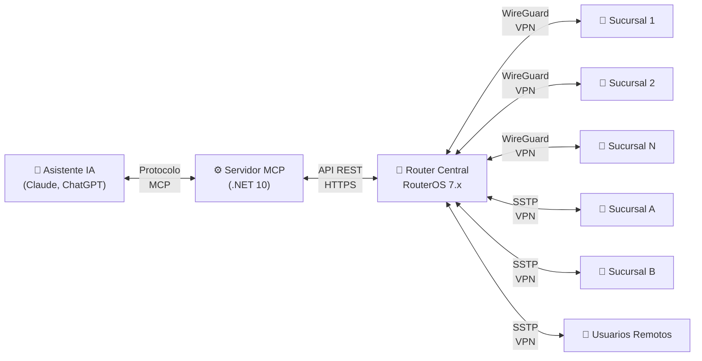
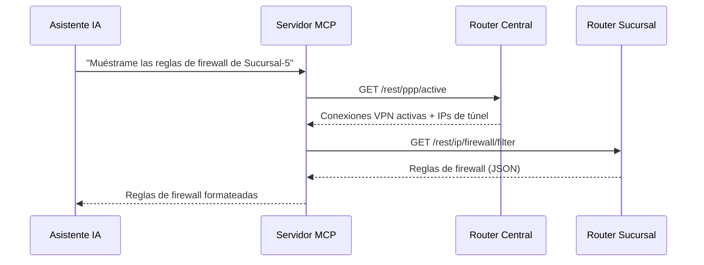
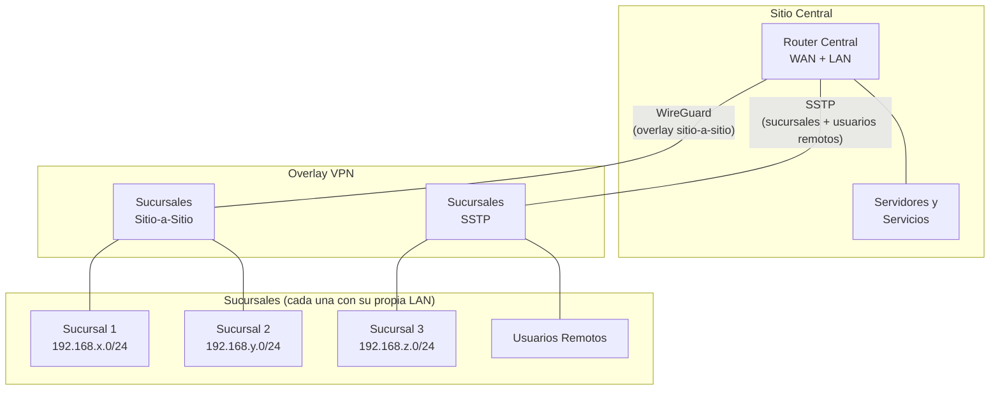

# mikrotik-mcp

> Un servidor MCP que permite a asistentes de IA gestionar redes MikroTik RouterOS — desde reglas de firewall hasta túneles VPN, en docenas de routers, con lenguaje natural.

[🇬🇧 Read in English](README.md)

> [!WARNING]
> **Software en fase alpha.** Este proyecto está en desarrollo temprano y no ha sido auditado en seguridad. Ver [Advertencia de Seguridad](#-advertencia-de-seguridad) antes de usar.

## La Historia

Esto comenzó como un proyecto de fin de semana, construido completamente con asistencia de IA. Usando un usuario de RouterOS con permisos completos de administrador, ayudó a configurar y gestionar una red de producción completa desde cero:

- **1 router central + 13 sucursales**
- **2 tecnologías VPN** — WireGuard para túneles sitio-a-sitio + SSTP para sucursales y usuarios remotos
- **Reglas de firewall completas**, NAT y políticas de seguridad en todos los sitios
- **Gestión de DNS** con resolución de nombres interna en toda la red
- **Colas de tráfico** y gestión de ancho de banda
- **Monitoreo en tiempo real** de todos los routers remotos

Todo a través de conversación natural con un asistente de IA. El servidor MCP siempre fue accedido exclusivamente a través de una VPN — nunca fue expuesto a internet.

## Qué Hace

Este servidor implementa el [Model Context Protocol (MCP)](https://modelcontextprotocol.io/) para exponer la gestión de MikroTik RouterOS como herramientas que cualquier asistente de IA compatible (Claude, ChatGPT, etc.) puede usar.

Se conecta a tu **router central** a través de la API REST de RouterOS y **descubre automáticamente los routers remotos de sucursales** mediante conexiones VPN activas (PPP/SSTP y peers WireGuard). No necesitas registrar cada router manualmente — si está conectado por VPN, el servidor MCP lo encuentra.

## Arquitectura

### Cómo Funciona



### Flujo de Comunicación



### Topología de Red (Referencia)

Este es el tipo de arquitectura de red para el que esta herramienta fue diseñada:



**Supuestos clave:**
- Cada sucursal tiene su propia subred LAN
- Un router central gestiona todos los túneles VPN, DNS, firewall y enrutamiento
- Los routers de sucursal se acceden vía API REST a través de sus IPs de túnel VPN
- El servidor MCP descubre automáticamente qué routers están en línea mediante conexiones VPN activas

## Herramientas Disponibles

| Categoría | Cantidad | Herramientas |
|-----------|----------|-------------|
| **Sistema** | 5 | `get_system_info`, `get_system_health`, `get_logs`, `get_system_packages`, `get_system_clock` |
| **Interfaces** | 4 | `get_interfaces`, `get_ip_addresses`, `get_bridge`, `get_vlans` |
| **Firewall** | 5 | `get_firewall_filter`, `get_firewall_nat`, `get_firewall_mangle`, `get_firewall_address_lists`, `get_firewall_connections` |
| **Enrutamiento** | 6 | `get_routes`, `get_arp_table`, `get_dns`, `get_dhcp_server`, `get_dhcp_leases`, `get_ip_pool` |
| **VPN** | 1 | `get_vpn_status` |
| **Wireless** | 3 | `get_wireless_interfaces`, `get_wireless_clients`, `get_wireless_security` |
| **Colas** | 2 | `get_simple_queues`, `get_queue_tree` |
| **Genérico** | 2 | `run_command` (lectura), `run_write_command` (escritura) |
| **Descubrimiento** | 1 | `list_routers` |

Todas las herramientas soportan un parámetro opcional `router` para dirigirse a un router remoto específico por nombre o IP. Si se omite, el comando se ejecuta en el router central.

## Prerrequisitos

- [.NET 10 SDK](https://dotnet.microsoft.com/download/dotnet/10.0)
- Router(s) MikroTik con **RouterOS 7.x+**
- API REST de RouterOS habilitada (`/ip/service enable www-ssl`)
- Un usuario API dedicado en cada router (ver [Primeros Pasos](docs/getting-started.md))

## Inicio Rápido

1. **Clonar el repositorio:**
   ```bash
   git clone https://github.com/dospuntos-dev/mikrotik-mcp.git
   cd mikrotik-mcp
   ```

2. **Configurar la conexión al router:**

   Editar `MikroTikMcp/appsettings.json` (o crear `appsettings.Development.json`):
   ```json
   {
     "MikroTik": {
       "Host": "192.168.88.1",
       "Port": 443,
       "Protocol": "https",
       "User": "tu-usuario-api",
       "Password": "tu-contraseña-api"
     },
     "RemoteRouters": {
       "User": "tu-usuario-api",
       "Password": "tu-contraseña-api",
       "Port": 443,
       "Protocol": "https"
     }
   }
   ```

3. **Ejecutar el servidor:**
   ```bash
   dotnet run --project MikroTikMcp
   ```

4. **Conectar tu cliente MCP** a `http://localhost:5151`

   Para Claude Desktop, agregar a tu configuración MCP:
   ```json
   {
     "mcpServers": {
       "mikrotik": {
         "url": "http://localhost:5151/sse"
       }
     }
   }
   ```

## Configuración

| Configuración | Descripción | Requerido |
|---------------|-------------|-----------|
| `MikroTik:Host` | IP o hostname del router central | Sí |
| `MikroTik:Port` | Puerto de la API REST (usualmente 443) | Sí |
| `MikroTik:Protocol` | `https` o `http` | Sí |
| `MikroTik:User` | Usuario API en el router central | Sí |
| `MikroTik:Password` | Contraseña API | Sí |
| `RemoteRouters:User` | Usuario API en routers de sucursal | Sí |
| `RemoteRouters:Password` | Contraseña API para routers de sucursal | Sí |
| `RemoteRouters:Port` | Puerto API REST en routers de sucursal | Sí |
| `RemoteRouters:Protocol` | `https` o `http` | Sí |

Todas las configuraciones son requeridas al inicio — el servidor no arrancará con configuración faltante.

> **Limitación actual:** Todos los routers remotos deben compartir las mismas credenciales API (sección `RemoteRouters`). Credenciales por router aún no están soportadas — ver [Roadmap](#roadmap).

## Despliegue

### Desarrollo
```bash
dotnet run --project MikroTikMcp
```
Se ejecuta en Kestrel (servidor web integrado de .NET). No necesita IIS ni servidor web externo.

### Producción
Ver [Guía de Despliegue IIS](docs/deployment-iis.md) para configuración en Windows Server con IIS.

Soporte para Docker está planeado — ver [Roadmap](#roadmap).

## Roadmap

**Visión:** Evolucionar de un proyecto de fin de semana a una plataforma segura y de nivel producción para gestión de redes MikroTik mediante IA.

### Seguridad Primero (Prioridad)
- [ ] Autenticación en el endpoint MCP (API keys / OAuth)
- [ ] Modo solo-lectura por defecto (opt-in para operaciones de escritura)
- [ ] Credenciales por router y registro de routers (en lugar de credenciales compartidas para todos los remotos)
- [ ] Gestión segura de conexiones: validación de certificados TLS, certificate pinning
- [ ] Log de auditoría: cada comando enviado a cada router, quién lo disparó, cuándo
- [ ] Guía de privilegios mínimos de usuario API RouterOS por herramienta
- [ ] Análisis de sensibilidad de datos: documentar exactamente qué expone la API REST
- [ ] Filtrado de peticiones/respuestas: redactar campos sensibles antes de enviar al AI

### Corto Plazo
- [ ] Soporte Docker (Dockerfile + docker-compose)
- [ ] Herramientas de escritura (crear/modificar reglas de firewall, NAT, entradas DNS)
- [ ] Tests unitarios y de integración
- [ ] Backup y restauración de configuración

### Mediano Plazo
- [ ] Dashboard web para vista general de la red
- [ ] Alertas (cambios de estado de enlaces, CPU alto, túneles VPN caídos)
- [ ] Soporte multi-tenant (gestionar múltiples redes)
- [ ] Control de acceso basado en roles

### Largo Plazo
- [ ] Versión alojada / Cloud (SaaS)
- [ ] Auto-mapeo de topología de red
- [ ] Reportes de cumplimiento
- [ ] Sistema de plugins para herramientas personalizadas
- [ ] Soporte para otras plataformas de routers

## Advertencia de Seguridad

> [!CAUTION]
> **Este proyecto está en alpha. No ha sido auditado en seguridad.**

Esta herramienta fue construida y utilizada con un usuario RouterOS con permisos completos de administrador, y siempre fue operada exclusivamente dentro de una VPN — nunca fue expuesta a internet público.

### Riesgos Conocidos

- **Los agentes de IA pueden leer toda la configuración de tu red.** Reglas de firewall, configuraciones VPN, tablas ARP, entradas DNS, leases DHCP, tablas de enrutamiento — la API REST de RouterOS expone todo esto. Aún no entendemos completamente qué información sensible un modelo de IA puede retener, registrar o exponer inadvertidamente a través de sus respuestas.

- **Sin autenticación en el endpoint MCP.** Cualquiera que pueda alcanzar el servidor puede enviar comandos a tus routers.

- **La validación de certificados SSL está deshabilitada** por defecto (los certificados auto-firmados son comunes en RouterOS).

- **Los comandos de escritura están disponibles.** La herramienta `run_write_command` puede modificar la configuración del router. Un prompt de IA mal configurado podría causar daños.

### Recomendaciones

1. **Nunca expongas el servidor MCP a internet.** Ejecútalo detrás de una VPN o firewall.
2. Crea un **usuario API de RouterOS de solo lectura** (grupo `api` con solo políticas de lectura) en lugar de usar una cuenta con permisos completos.
3. Usa el servidor MCP solo en redes que poseas y controles.
4. Revisa las respuestas del AI cuidadosamente antes de aplicar cualquier operación de escritura.

## Licencia

Este proyecto está licenciado bajo la [GNU Affero General Public License v3.0](LICENSE).

Puedes usar, modificar y distribuir este software libremente. Si lo ofreces como servicio (SaaS), debes hacer tus modificaciones disponibles bajo la misma licencia.

## Contribuir

Ver [CONTRIBUTING.md](CONTRIBUTING.md) para guías sobre cómo contribuir.

## Reporte de Seguridad

Para reportar una vulnerabilidad de seguridad, por favor usa el [reporte privado de vulnerabilidades de GitHub](https://docs.github.com/en/code-security/security-advisories/guidance-on-reporting-and-writing-information-about-vulnerabilities/privately-reporting-a-security-vulnerability) en este repositorio. No abras un issue público para vulnerabilidades de seguridad.
