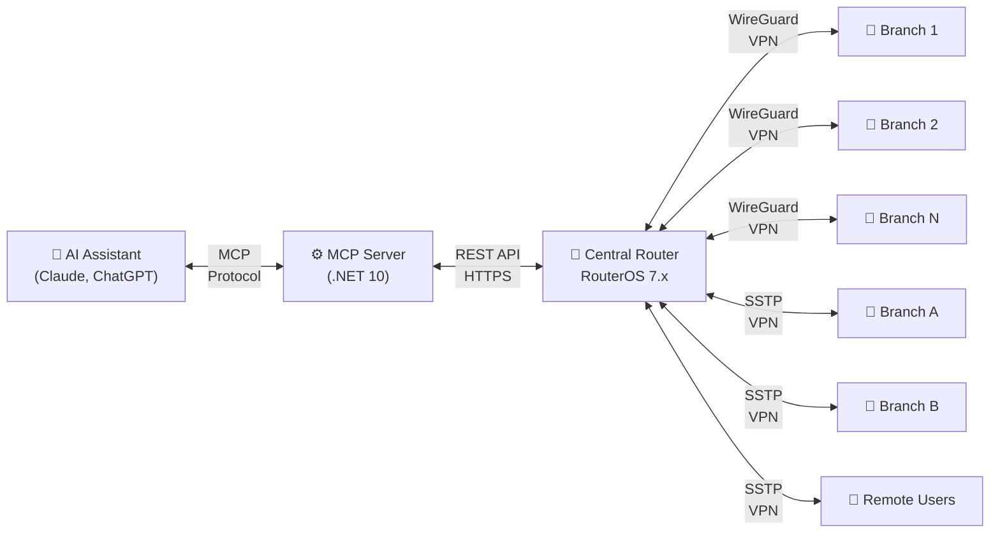
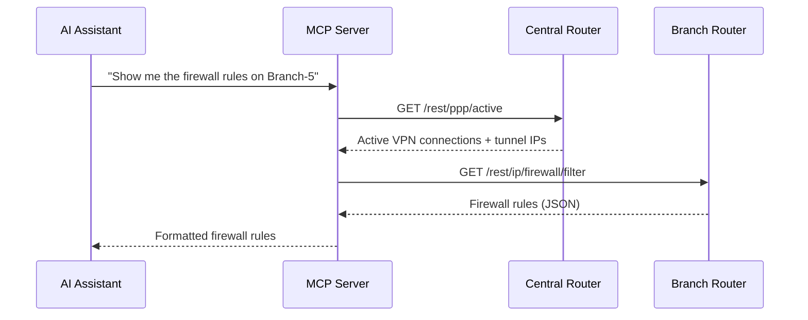
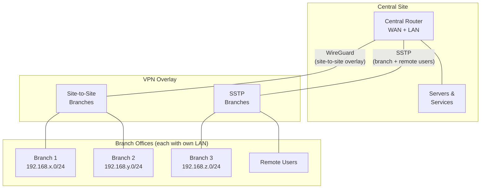

# mikrotik-mcp

> An MCP server that lets AI assistants manage MikroTik RouterOS networks — from firewall rules to VPN tunnels, across dozens of routers, with natural language.

[🇪🇸 Leer en español](README.es.md)

> [!WARNING]
> **Alpha software.** This project is in early development and has not been security-audited. See [Security Warning](#-security-warning) before using.

## The Story

This started as a weekend project, built entirely with AI assistance. Using a full-admin RouterOS user, it helped configure and manage an entire production network from scratch:

- **1 central router + 13 branch offices**
- **2 VPN technologies** — WireGuard for site-to-site tunnels + SSTP for branches and remote users
- **Complete firewall rules**, NAT, and security policies across all sites
- **DNS management** with internal name resolution across the entire network
- **Traffic queues** and bandwidth management
- **Real-time monitoring** of all remote routers

All through natural conversation with an AI assistant. The MCP server was always accessed exclusively through a VPN — never exposed to the internet.

## What It Does

This server implements the [Model Context Protocol (MCP)](https://modelcontextprotocol.io/) to expose MikroTik RouterOS management as tools that any compatible AI assistant (Claude, ChatGPT, etc.) can use.

It connects to your **central router** via the RouterOS REST API and **automatically discovers remote branch routers** through active VPN connections (PPP/SSTP and WireGuard peers). No need to manually register each router — if it's connected via VPN, the MCP server finds it.

## Architecture

### How It Works



### Communication Flow



### Network Topology (Reference)

This is the type of network architecture this tool was designed for:



**Key assumptions:**
- Each branch office has its own LAN subnet
- A central router manages all VPN tunnels, DNS, firewall, and routing
- Branch routers are accessed via REST API through their VPN tunnel IPs
- The MCP server auto-discovers which routers are online via active VPN connections

## Available Tools

| Category | Count | Tools |
|----------|-------|-------|
| **System** | 5 | `get_system_info`, `get_system_health`, `get_logs`, `get_system_packages`, `get_system_clock` |
| **Interfaces** | 4 | `get_interfaces`, `get_ip_addresses`, `get_bridge`, `get_vlans` |
| **Firewall** | 5 | `get_firewall_filter`, `get_firewall_nat`, `get_firewall_mangle`, `get_firewall_address_lists`, `get_firewall_connections` |
| **Routing** | 6 | `get_routes`, `get_arp_table`, `get_dns`, `get_dhcp_server`, `get_dhcp_leases`, `get_ip_pool` |
| **VPN** | 1 | `get_vpn_status` |
| **Wireless** | 3 | `get_wireless_interfaces`, `get_wireless_clients`, `get_wireless_security` |
| **Queues** | 2 | `get_simple_queues`, `get_queue_tree` |
| **Generic** | 2 | `run_command` (read), `run_write_command` (write) |
| **Discovery** | 1 | `list_routers` |

All tools support an optional `router` parameter to target a specific remote router by name or IP. If omitted, the command runs on the central router.

## Prerequisites

- [.NET 10 SDK](https://dotnet.microsoft.com/download/dotnet/10.0)
- MikroTik router(s) with **RouterOS 7.x+**
- RouterOS REST API enabled (`/ip/service enable www-ssl`)
- A dedicated API user on each router (see [Getting Started](docs/getting-started.md))

## Quick Start

1. **Clone the repository:**
   ```bash
   git clone https://github.com/dospuntos-dev/mikrotik-mcp.git
   cd mikrotik-mcp
   ```

2. **Configure your router connection:**

   Edit `MikroTikMcp/appsettings.json` (or create `appsettings.Development.json`):
   ```json
   {
     "MikroTik": {
       "Host": "192.168.88.1",
       "Port": 443,
       "Protocol": "https",
       "User": "your-api-user",
       "Password": "your-api-password"
     },
     "RemoteRouters": {
       "User": "your-api-user",
       "Password": "your-api-password",
       "Port": 443,
       "Protocol": "https"
     }
   }
   ```

3. **Run the server:**
   ```bash
   dotnet run --project MikroTikMcp
   ```

4. **Connect your MCP client** to `http://localhost:5151`

   For Claude Desktop, add to your MCP config:
   ```json
   {
     "mcpServers": {
       "mikrotik": {
         "url": "http://localhost:5151/sse"
       }
     }
   }
   ```

## Configuration

| Setting | Description | Required |
|---------|-------------|----------|
| `MikroTik:Host` | Central router IP or hostname | Yes |
| `MikroTik:Port` | REST API port (usually 443) | Yes |
| `MikroTik:Protocol` | `https` or `http` | Yes |
| `MikroTik:User` | API username on central router | Yes |
| `MikroTik:Password` | API password | Yes |
| `RemoteRouters:User` | API username on branch routers | Yes |
| `RemoteRouters:Password` | API password for branch routers | Yes |
| `RemoteRouters:Port` | REST API port on branch routers | Yes |
| `RemoteRouters:Protocol` | `https` or `http` | Yes |

All settings are required at startup — the server will not start with missing configuration.

> **Current limitation:** All remote routers must share the same API credentials (`RemoteRouters` section). Per-router credentials are not yet supported — see [Roadmap](#roadmap).

## Deployment

### Development
```bash
dotnet run --project MikroTikMcp
```
Runs on Kestrel (built-in .NET web server). No IIS or external web server needed.

### Production
See [IIS Deployment Guide](docs/deployment-iis.md) for Windows Server setup with IIS.

Docker support is planned — see [Roadmap](#roadmap).

## Roadmap

**Vision:** Evolve from a weekend project into a secure, production-grade platform for MikroTik network management through AI.

### Security First (Priority)
- [ ] Authentication on MCP endpoint (API keys / OAuth)
- [ ] Read-only mode by default (opt-in for write operations)
- [ ] Per-router credentials and router registry (instead of shared credentials for all remotes)
- [ ] Secure connection management: TLS certificate validation, certificate pinning
- [ ] Audit log: every command sent to every router, who triggered it, when
- [ ] RouterOS API user privilege guide (minimal required permissions per tool)
- [ ] Data sensitivity analysis: document exactly what the REST API exposes
- [ ] Request/response filtering: redact sensitive fields before sending to AI

### Short Term
- [ ] Docker support (Dockerfile + docker-compose)
- [ ] Write tools (create/modify firewall rules, NAT, DNS entries)
- [ ] Unit and integration tests
- [ ] Configuration backup and restore

### Medium Term
- [ ] Web dashboard for network overview
- [ ] Alerting (link status changes, high CPU, failed VPN tunnels)
- [ ] Multi-tenant support (manage multiple networks)
- [ ] Role-based access control

### Long Term
- [ ] Hosted / Cloud version (SaaS)
- [ ] Network topology auto-mapping
- [ ] Compliance reporting
- [ ] Plugin system for custom tools
- [ ] Support for other router platforms

## Security Warning

> [!CAUTION]
> **This project is in alpha. It has not been security-audited.**

This tool was built and used with a full-admin RouterOS user, and was always operated exclusively within a VPN — never exposed to the public internet.

### Known Risks

- **AI agents can read your entire network configuration.** Firewall rules, VPN configurations, ARP tables, DNS entries, DHCP leases, routing tables — the RouterOS REST API exposes all of this. We do not yet fully understand what sensitive information an AI model may retain, log, or inadvertently expose through its responses.

- **No authentication on the MCP endpoint.** Anyone who can reach the server can issue commands to your routers.

- **SSL certificate validation is disabled** by default (self-signed certificates are common on RouterOS).

- **Write commands are available.** The `run_write_command` tool can modify router configuration. A misconfigured AI prompt could cause damage.

### Recommendations

1. **Never expose the MCP server to the internet.** Run it behind a VPN or firewall.
2. Create a **read-only RouterOS API user** (`api` group with only read policies) instead of using a full-admin account.
3. Use the MCP server only on networks you own and control.
4. Review AI responses carefully before applying any write operations.

## License

This project is licensed under the [GNU Affero General Public License v3.0](LICENSE).

You can freely use, modify, and distribute this software. If you offer it as a service (SaaS), you must make your modifications available under the same license.

## Contributing

See [CONTRIBUTING.md](CONTRIBUTING.md) for guidelines on how to contribute.

## Security Reporting

To report a security vulnerability, please use [GitHub's private vulnerability reporting](https://docs.github.com/en/code-security/security-advisories/guidance-on-reporting-and-writing-information-about-vulnerabilities/privately-reporting-a-security-vulnerability) on this repository. Do not open a public issue for security vulnerabilities.
