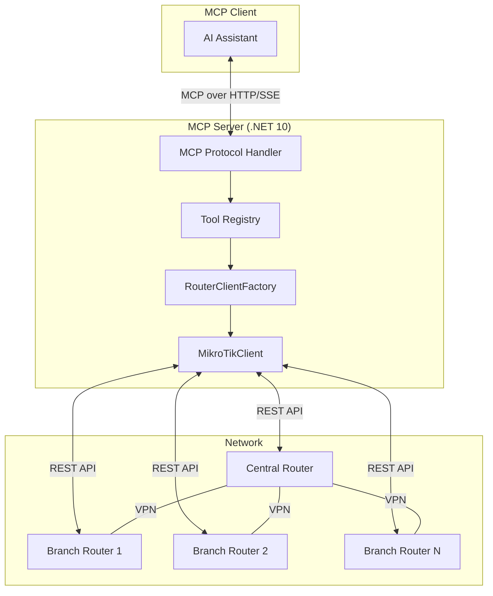
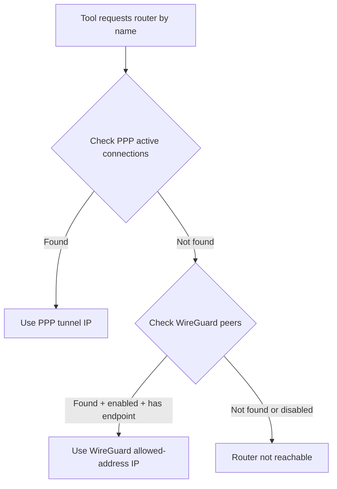
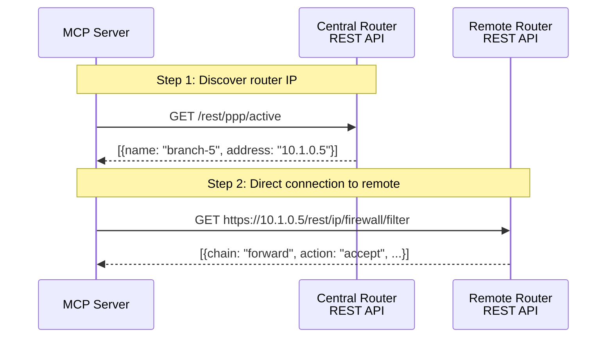
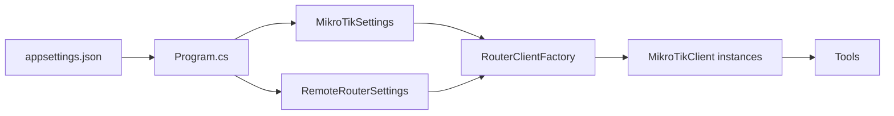

# Architecture

## Overview

mikrotik-mcp is a .NET 10 web application that implements the [Model Context Protocol (MCP)](https://modelcontextprotocol.io/) to expose MikroTik RouterOS management as AI-consumable tools.



## Components

### MikroTikClient (`Services/MikroTikClient.cs`)

Low-level HTTP client that communicates with the RouterOS REST API. Handles:
- HTTPS/HTTP connections with Basic authentication
- Path normalization for RouterOS REST endpoints
- Response parsing and error handling
- Request/response logging with timing

### RouterClientFactory (`Services/RouterClientFactory.cs`)

Manages connections to all routers in the network:
- Creates and caches `MikroTikClient` instances
- **Router discovery**: finds remote routers by querying active VPN connections
- Name-to-IP resolution with caching

### Router Discovery Algorithm

The factory discovers remote routers through two mechanisms, in priority order:



1. **PPP active connections** (`/ppp/active`) — Highest priority. If a router is connected via SSTP/L2TP/PPPoE, its tunnel IP is known and the router is definitely online.

2. **WireGuard peers** (`/interface/wireguard/peers`) — Secondary. The peer must not be disabled and must have a `current-endpoint-address` (indicating an active handshake). The tunnel IP is extracted from the `allowed-address` field.

### Tool Registration

Tools are organized by category in the `Tools/` directory. Each tool class is decorated with `[McpServerToolType]` and individual tools with `[McpServerTool]`:

```csharp
[McpServerToolType]
public sealed class FirewallTools
{
    [McpServerTool(Name = "get_firewall_filter", ReadOnly = true)]
    [Description("Get all firewall filter rules")]
    public static async Task<string> GetFirewallFilter(
        RouterClientFactory factory,
        [Description("Router name or IP (optional)")] string? router = null,
        CancellationToken ct = default)
    {
        var client = router is null
            ? factory.Central
            : await factory.GetClientAsync(router, ct);
        var result = await client.GetAsync("/ip/firewall/filter", ct);
        return result;
    }
}
```

### Remote Router Access

Remote routers are accessed **directly** via their VPN tunnel IPs using the REST API. The MCP server connects to each router individually over HTTPS (or HTTP, depending on configuration).



## Configuration Flow



All configuration is validated at startup. Missing required fields cause the server to fail immediately with a clear error message, rather than failing later at runtime.
